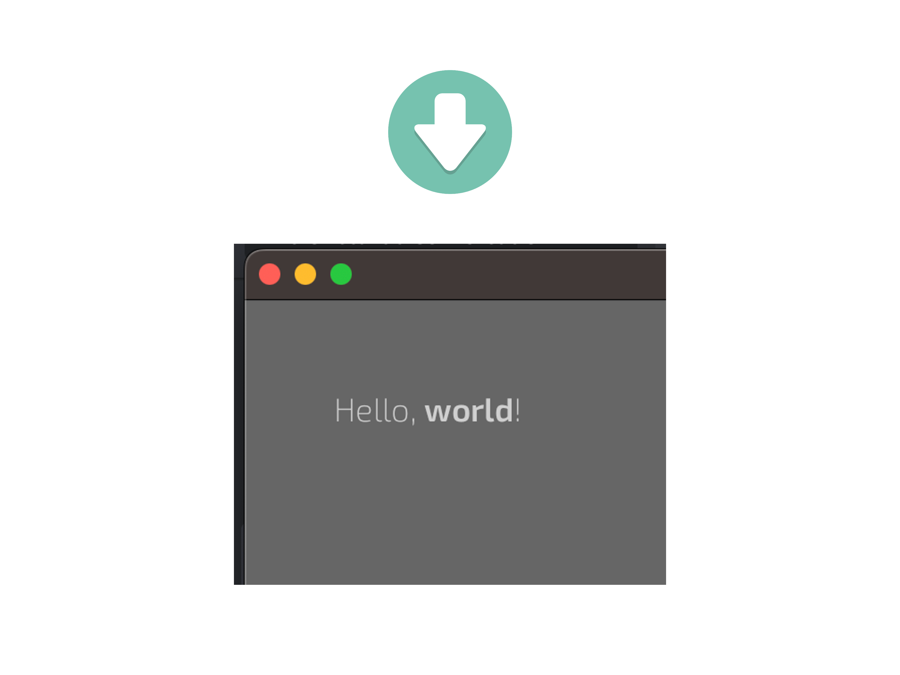

*There is no way to feel the happiness without understanding the pain.*

About
-----

`Elements` is a plugin for `bevy` game engine that helps to declaratively define a user interface with `eml` markup (macros & asset), a very-css-like `ess` syntax, and specifying relationships between data using `connect!` & `bind!`.

The main tasks the plugin is about to solve are:
- fill the spaces in the `bevy` UI system (inputs, scrolls, text layout, etc.)
- reduce the [boilerplate](https://bevyengine.org/examples/ui/ui/) defining the UI
- allow to effectively separate the layout, styling, data & logic from each other
- build a base to provide various tools for *`game`* developers & designers

During plugin development I am guided by the following values:
- type safity: *about to explain*
- namespace safity: *about to explain*
- no compromises: *about to explain*
- on the top of `bevy`: *about to explain*
- performance matters: *about to explain*
- beauty matters as well: *about to explain*
- tooling rocks: *about to explain*

Prerequisites & Setup
---------------------

As far as the project has no cargo release yet, the only way to discover functionality
is to clone repo & play with examples:

```
git clone https://github.com/jkb0o/belly.git
cd belly
cargo run --example color_picker
```

If you are brave enough, you can connect the plugin by referencing github repo in your `Cargo.toml`.

Basics
------

Not another word! Let's write code:

```rust
use bevy::prelude::*;
use belly::prelude::*;

fn main() {
    App::new()
        .add_plugins(DefaultPlugins)
        .add_plugin(BellyPlugin)
        .add_startup_system(setup)
        .run();
}

fn setup(mut commands: Commands) {
    commands.spawn(Camera2dBundle::default());
    commands.add(eml! {
        <body s:padding="50px">
            "Hello, "<strong>"world"</strong>"!"
        </body>
    });
}
```



Styling
-------
*I've paid my dues*

*Time after time*


Binds
-----
*I've done my sentence*

*But committed no crime*

Events
------
*And bad mistakes*

*I've made a few*


Widgets
-------
*I've had my share of sand*

*Kicked in my face*


Style properties
----------------

*But I've come through*


Examples
--------

*And we mean to go on and on and on and on*

Roadmap
-------

*We are the champions, my friends...*


*And we'll keep on fighting till the end!!!*

License
-------
`belly` is dual-licensed under either:

- MIT License ([LICENSE-MIT](LICENSE-MIT) or [http://opensource.org/licenses/MIT](http://opensource.org/licenses/MIT))
- Apache License, Version 2.0 ([LICENSE-APACHE](LICENSE-APACHE) or [http://www.apache.org/licenses/LICENSE-2.0](http://www.apache.org/licenses/LICENSE-2.0))

This means you can select the license you prefer!
This dual-licensing approach is the de-facto standard in the Rust ecosystem and there are [very good reasons](https://github.com/bevyengine/bevy/issues/2373) to include both.


