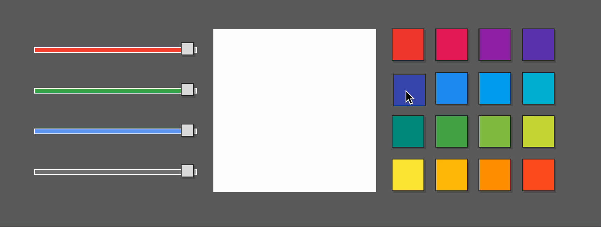
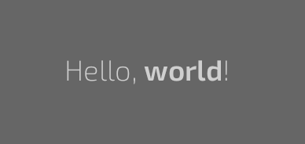
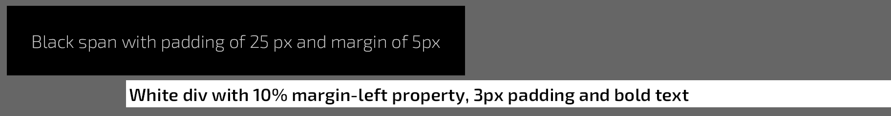
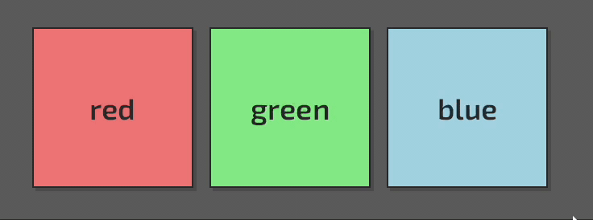
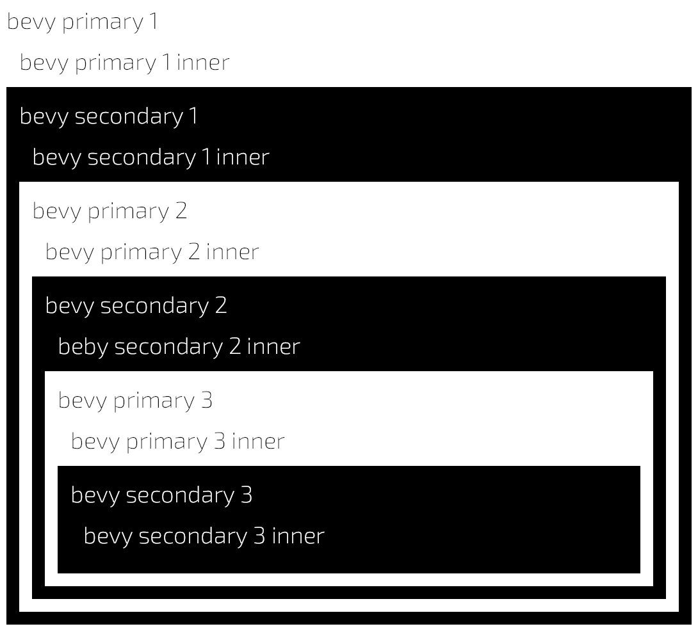
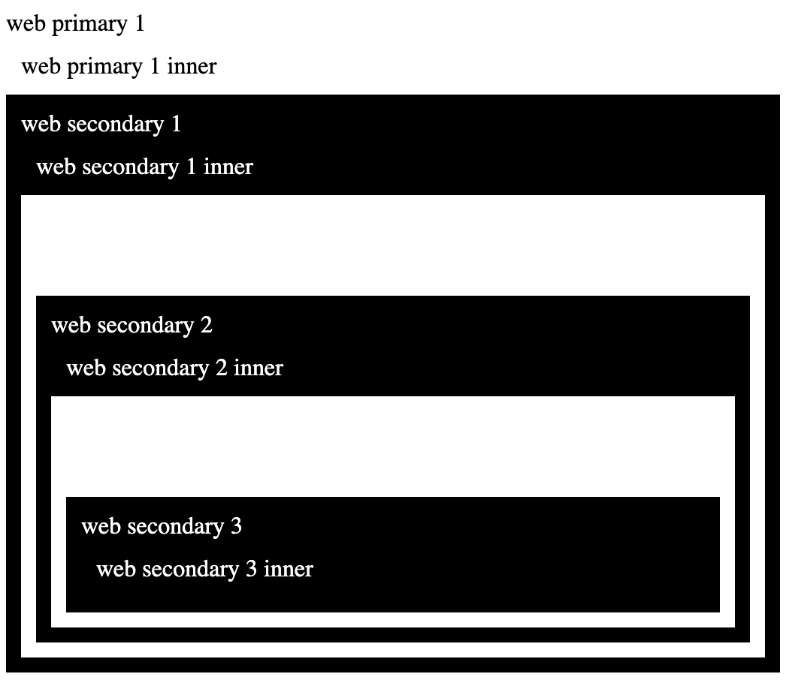
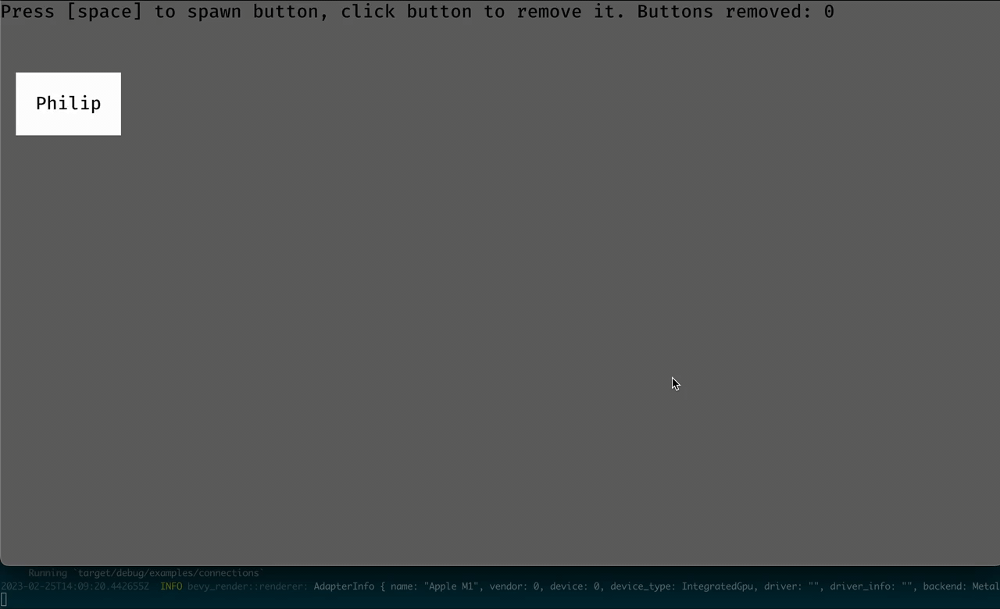
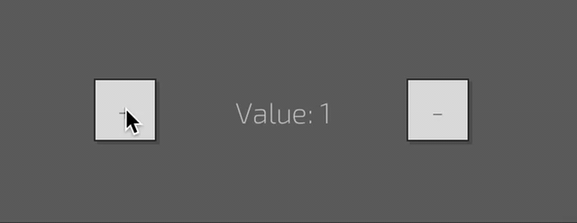
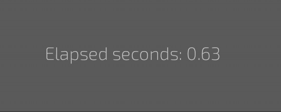
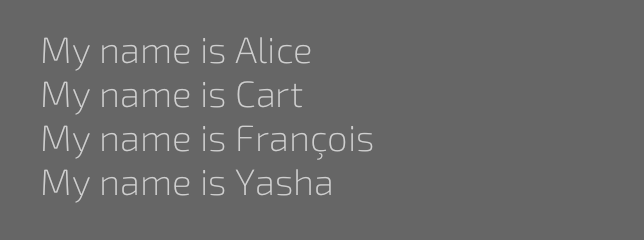

## About

---

The `belly` is a plugin for a `bevy` game engine that helps to declaratively define a user interface with `eml` markup (macros & asset), style it with a very CSS-like `ess` syntax, and define data flow using `from!` & `to!` bind macros and/or connect events to handlers (funcs).

#### API Reference

- [Style Properties](docs/style-properties.md)
- [Widgets](docs/widgets.md)
- Bind transformers (work in progress)
- Crate docs (work in progress)

#### Example

```rust
// examples/color-picker.rs
// cargo run --example color-picker
use belly::prelude::*;
use bevy::prelude::*;

fn main() {
    App::new()
        .add_plugins(DefaultPlugins)
        .add_plugin(BellyPlugin)
        .add_startup_system(setup)
        .run();
}

const COLORS: &[&'static str] = &[
    // from https://colorswall.com/palette/105557
    // Red     Pink       Purple     Deep Purple
    "#f44336", "#e81e63", "#9c27b0", "#673ab7",
    // Indigo  Blue       Light Blue Cyan
    "#3f51b5", "#2196f3", "#03a9f4", "#00bcd4",
    // Teal    Green      Light      Green Lime
    "#009688", "#4caf50", "#8bc34a", "#cddc39",
    // Yellow  Amber      Orange     Deep Orange
    "#ffeb3b", "#ffc107", "#ff9800", "#ff5722",
];

fn setup(mut commands: Commands) {
    commands.spawn(Camera2dBundle::default());
    commands.add(StyleSheet::load("color-picker.ess"));
    let colorbox = commands.spawn_empty().id();
    commands.add(eml! {
        <body>
            <span c:controls>
                <slider c:red
                    bind:value=to!(colorbox, BackgroundColor:0|r)
                    bind:value=from!(colorbox, BackgroundColor:0.r())
                />
                <slider c:green
                    bind:value=to!(colorbox, BackgroundColor:0|g)
                    bind:value=from!(colorbox, BackgroundColor:0.g())
                />
                <slider c:blue
                    bind:value=to!(colorbox, BackgroundColor:0|b)
                    bind:value=from!(colorbox, BackgroundColor:0.b())
                />
                <slider c:alpha
                    bind:value=to!(colorbox, BackgroundColor:0|a)
                    bind:value=from!(colorbox, BackgroundColor:0.a())
                />
            </span>
            
                <span {colorbox} c:colorbox s:background-color=managed()
                    on:ready=run!(|c: &mut BackgroundColor| c.0 = Color::WHITE)/>
            </img>
            <span c:colors>
            <for color in = COLORS>
                <button on:press=run!(for colorbox |c: &mut BackgroundColor| { c.0 = Color::from_hex(color) })>
                    <span s:background-color=*color s:width="100%" s:height="100%"/>
                </button>
            </for>
            </span>
        </body>
    });
}
```


The main tasks the plugin is about to solve are:
- fill the space in the `bevy` UI system (inputs, scrolls, text layout, etc.)
- reduce the [boilerplate](https://bevyengine.org/examples/ui/ui/) defining the UI
- allow to effectively separate the layout, styling, data & logic from each other
- build the basis to provide various tools for *`game`* developers & designers

#### <a name="features"></a> Features:
- Hierarcy definition using `eml` macro or asset
- Style definition using direct attributes or `ess` stylesheet assets
- Hot-reloading for `eml` and `ess` assets
- Data bindings for resources, components, params and content
- Event -> handler connections
- Predefined styles properties for every piece os UI
- Basic templating (for-loops, slots)
- Out of the box default styles & fonts
- Ability to define custom widgets, properties, and bind transformers
- Style & behaviour extending
- Predefined widgets for configuring layout, generating content and handling input:
  - body, div, span, br, strong
  - img, progressbar, label
  - textinput, slider, button, buttongroup
- Styleboxes (9-patch-slices/`image-border`)

#### <a name="upcoming-features"></a> Upcoming features:
- Complete rich-text processing
- True inline/block/inline-block elements
- Binding transitions (changing values over time)
- Style transitions (changing style properties over time)
- Scene-based widgets
- Styled drawing primitives (lines, rects, curves, shapes)
- Asset validation tools
- In-game developer panel with UI tree & style inspector
- More widgets (tabview, scrollarea, checkbox, attach, line, popup, tooltip)
- Developer tools (vscode plugin)
- Localization
- Scripting
- Theming
- Asset loading progress handling
- More templating (if/else)

---

## <a name="table-of-contents"></a> Table of contents

---

- [Prerequisites & Setup](#setup)
- [Basics](#basics)
- [Tags, Widgets & Content](#tags-widgets-content)
- [Styling](#styling)
  - [Style Params](#style-params)
  - [StyleSheets](#stylesheets)
  - [Selectors](#selectors)
  - [Selectors weights & resolving order](#selector-weights)
  - [Managed properties](#managed-properties)
  - [Default styles](#default-styles)
- [Data flow & relations](#data-flow)
  - [Connections](#connections)
  - [Connecting Widgets](#connecting-widgets)
  - [Data Bindnings Introduction](#bindings-intro)
  - [Data transformers](#data-transformers)
    - [Format transformer](#format-transformer)
    - [Global transformers](#global-transformers)
    - [Associated transformers](#associated-transformers)
  - [Binding from Resources](#binding-from-resources)
  - [Forms of `from!` & `to!` macros](#forms-of-relations)
- [Templating](#templating)
  - [Loops](#loops)
  - [Slots](#slots)
- [Building Widgets](#building-widgets)
- [Implementing custom Styles](#custom-styles)
- [Writing Transformers](#writing-transformers)
- [License](#license)

---

## <a name="setup"></a> Prerequisites & Setup

---

As far as the project has no cargo release yet, the only way to discover functionality is to clone the repo & play with examples:

```
git clone https://github.com/jkb0o/belly.git
cd belly
cargo run --example color-picker
```

If you are brave enough, you can connect the plugin by referencing the GitHub repo in your `Cargo.toml`.

---

## <a name="basics"></a> Basics

---

In the `belly`, you define UI layout using `eml`. It is possible to do it directly from the code using the `eml!` macro or by loading the `.eml` asset and adding `EmlScene`. In the case of macro `eml` is more than just markup, but more like templating language, `jsx` from the javascript world. In the case of the `.eml` asset, `eml` is just an XML file with no special syntax. From now I'll focus on `eml!` macro:


```rust
// examples/hello-world.rs
// cargo run --example hello-world
use belly::prelude::*;
use bevy::prelude::*;

fn main() {
    App::new()
        .add_plugins(DefaultPlugins)
        .add_plugin(BellyPlugin)
        .add_startup_system(setup)
        .run();
}

fn setup(mut commands: Commands) {
    commands.spawn(Camera2dBundle::default());
    commands.add(eml! {
        <body s:padding="50px">
            "Hello, "<strong>"world"</strong>"!"
        </body>
    });
}

```


The `eml!` macro expands its content into multiple calls which spawn entities with required components based on the tags and their attributes. Most of these tags in the `belly` called `Widgets`. When the `belly` builds the tree it unfolds each widget into one (or more) entities. The structure from the example above becomes something like this:

- Node (body)
  - TextNode ("Hello, ")
  - Node (strong)
    - TextNode ("world")
  - TextNode ("!")

In addition to common bevy UI components (Node, Text, BackgroundColor, etc.) `belly` inserts an `Element` component. It holds information about tag name(s), styles, classes, and states.

For configuring widget style & behavior you can pass attributes within the tag. These attributes are called `params` in the `belly` and may be passed in different ways:
- **common** params passed as key-value pairs: ``
- **style** params passed using `s:` prefix: `<span s:padding="50px>`
- **class** params passed using `c:` prefix (`<span c:some-class>`) or by `class` param    (`<span class="some-class-1 some-class-2">`)
- **binds** passed using `bind:` prefix: `<buttongroup bind:value=to!(img, Img:src)>`
- **connections** passed using `on:` prefix: `<button on:press=|_| info!("I'm pressed!")/>`
- **entity** passed using curly braces: `<span {span_id}>` or using `entity` param: `<span entity=span_id>`
- **components** passed using `with` param: `<button with=(MyComponent, another_component_instance)/>`

---

## <a name="tags-widgets-content"></a> Tags, Widgets & Content

---

As I said `eml` consists of tags with attributes. Everything between the open-closing tag pair (`<span>...</span>`) becomes the children of this tag. The tag also may have no children at all, the self-closing tag used in this case: `<button/>`. Every tag may have this kind of child:
- other tags: `<span><button/></span>` 
- string literals: `<span>"Hello world!"</span>`
- rust blocks: `<span>{ some_content() }</span>`

Rust block can be any expression that returns `impl IntoContent`. `String` implements the `IntoContent` trait for example, as well as `Vec<Entity>` does. Some other types provide this implementation too, `binds`, for example, I'll talk about this later.

As I mentioned earlier, almost every tag meant to be `Widget`it produces one or more entities with their own set of components, styles, and states. I will talk about widgets all the time. Later I'll introduce to you non-widget tags & some templating features of `belly` but for now, let's focus on widgets and styling features.

---

## <a name="styling"></a> Styling

---
Usually, in `bevy`, you define styles (how your content looks) by passing properties to UI bundles. Unfortunately, it can produce a lot of boilerplate. `belly` can help you to create more readable styling code/content in multiple ways. The core idea is to define some style properties (`width`, `background-color`, `flex-direction`, etc.) and map them somehow to the actual components and their properties. This mapping is done by the `Property` trait. Implementations of this trait define the style property name (`width`), how it should be parsed (to `Val`), and how to apply parsed value to the exact component (`Style`'s `size.width`)

There are two ways to provide style properties to nodes: by passing style param directly to a widget or by declaring the `StyleSheet`: the sets of style properties and rules that determine which nodes these sets should apply to.

---

### <a name="style-params"></a> Style Params

---

The easiest way to provide some style to your UI using `belly` is to pass some params directly
to widgets:

```rust
// examples/style-params.rs
// cargo run --example style-params
use bevy::prelude::*;
use belly::prelude::*;

fn main() {
    App::new()
        .add_plugins(DefaultPlugins)
        .add_plugin(BellyPlugin)
        .add_startup_system(setup)
        .run();
}

fn setup(mut commands: Commands) {
    commands.spawn(Camera2dBundle::default());
    let ten_percent = Val::Percent(10.);
    commands.add(eml! {
        <body s:padding="5px">
            <span s:padding="25px" s:margin="5px" s:background-color="black">
                "Black span with padding of 25 px and margin of 5px"
            </span>
            <div s:font="bold" s:padding="3px" s:color="black" s:background-color=Color::WHITE  s:margin-left=ten_percent >
                "White div with 10% margin-left property, 3px padding and bold text"
            </div>
        </body>
    });
}
```


In the example above you can see various ways to pass style params to nodes.
- Passing as strings. `belly` will parse these strings once and convert them into actual values. `s:padding="25px"` is equivalent to  `Style { padding: UISize::all(Val::Px(25.))}`
- Passing as values. `s:background-color=Color::RED` passed to `Style` as is
- Passing as variables. Style param can be any valid rust expression.

When you passing style (or common) param to the node, `belly` converts the value into the `Variant` enum using `.into()` call. This way you can pass to values everything matching these requirements:
- it should be able to be passed by value, not reference
- it should implement `Into<Variant>` trait.

A `Variant` is used only for passing params and converting them to concrete types at the building stage and not used afterward, so performance loss is minimal. `belly` also will warn you about any failed conversion cases.

---

### <a name="stylesheets"></a> StyleSheets

---

Adding styles using params is easy to write, but difficult to maintain. You also need to recompile your project to see the changes. This is time for the `StyleSheet` to come out:

```css
/* stylesheet.ess */
body {
    padding: 5px;
}
span {
    padding: 25px;
    margin: 5px;
    background-color: black;
}
div {
    font: bold;
    color: black;
    padding: 3px;
    background-color: white;
    margin-left: 10%;
}
```

```rust
// examples/style-sheet.rs
// cargo run --example style-sheet
use belly::prelude::*;
use bevy::prelude::*;

fn main() {
    App::new()
        .add_plugins(DefaultPlugins)
        .add_plugin(BellyPlugin)
        .add_startup_system(setup)
        .run();
}

fn setup(mut commands: Commands) {
    commands.spawn(Camera2dBundle::default());
    commands.add(StyleSheet::load("stylesheet.ess"));
    commands.add(eml! {
        <body>
            <span>"Black span with padding of 25 px and margin of 5px"</span>
            <div>"White div with 10% margin-left property, 3px padding and bold text"</div>
        </body>
    });
}
```

The `StyleSheet` consists of sets of style properties and rules that determine which nodes these sets should apply to.

In the example above I define `StyleSheet` asset `styelsheets.ess` with styles for every `<body>`, `<span>`, or `<div>` you add to the UI. Each `StyleSheet` is loaded into the global namespace and affects all matched elements. You add as many stylesheets as you want. You can load stylesheets from assets as well as parse the content:
```rust
// load StyleSheet from asset
commands.add(StyleSheet::load("stylesheets.ess"));
// parse StyleSheet content
commands.add(StyleSheet::parse(r"#
    body {
        padding: 50px;
    }
#"));
```

---

### <a name="selectors"></a> Selectors

---

A `StyleSheet` contains the list of rules (selector with properties). In the example above the `body` is the selector and everything inside curly braces are properties. The `body` selector picks all nodes defined by the `body` tag. It is useful for some cases, but not enough for the rest when you want to select exact nodes to apply properties. In this case, you need a more complex selector, which consists of subselectors, `button:pressed .colored-area` for example. `belly` comes with this types of subselectors:
- `name` selects elements by tag name (`body`, `span`)
- `.class` selects elements that contain exact class: `.some-class`
- `#id` selects elements with exact id: `#some-id`
- `:state` selects elements with the exact state: `:pressed`, `:hover`, etc.
- `*` (any) selects any element
- ` ` (any-child) select child of any level with matched subselector
- `>` (direct-child) select direct child elements with matched subselector

There is a little bit more complex example:

```css
/* selectors.ess */
* {
    font: bold;
    color: darkgrey;
}
body {
    padding: 20px;
}

button {
    width: 100px;
    height: 100px;
}

button .content {
    width: 100%;
    height: 100%;
    justify-content: center;
    align-items: center;
}

.red .content {
    background-color: lightcoral;
}
.green .content {
    background-color: lightgreen;
}

.blue .content {
    background-color: lightblue;
}

button:hover .content {
    background-color: white;
}
```
```rust
// examples/selectors.rs
// cargo run --example selectors
use belly::prelude::*;
use bevy::prelude::*;

fn main() {
    App::new()
        .add_plugins(DefaultPlugins)
        .add_plugin(BellyPlugin)
        .add_startup_system(setup)
        .run();
}

fn setup(mut commands: Commands) {
    commands.spawn(Camera2dBundle::default());
    commands.add(StyleSheet::load("selectors.ess"));
    commands.add(eml! {
        <body>
            <button c:red><span c:content>"red"</span></button>
            <button c:green><span c:content>"green"</span></button>
            <button c:blue><span c:content>"blue"</span></button>
        </body>
    });
}
```


In this example, I apply classes (`red`, `green`, `blue`, `content`) to the nodes and define `StyleSheet` with precise rules to achieve the task: three buttons of defined colors, each becoming white on hover.

I'd like to explain some selectors:
- `button .content` applies its properties to every node with the `content` class which is the any-level-child of the `button` widget.
- `.red .content` applies its properties to every node with the `content` class which is the `any-level-child` of a node with the `red` class
- `button:hover .content` applies its properties to every node with the `content` class which is the `any-level-child` of the hovered button (`button` widget with `hover` state)

The interesting thing here is that at some point multiple selectors are valid for the same node: when I hover the red button both `button:hover .content` and `.red .content` pick the same node. Why the hovered button is always white but not red? How `belly` resolves this kind of conflict? I'm glad you asked!

---

### <a name="selector-weights"></a> Selectors weights & resolving order

---

When some `Element` is added or changed (you add/remove state or class for example), the `belly` begins the style resolving and applying process. This process is done for each property separately and consists of four main steps:
- check if `Element` has defined by param style property
- find all rules valid for the node
- select the most valuable rule for the node
- apply property defined in the selected rule

In the first step `belly` checks if the style property is defined using param (`<span s:padding="5px">`). If there is one, `belly` applies this property and does not process the next steps. This way, style props have the highest resolving priority.

The matching step is done by walking the tree branch from bottom to top. When `belly` does this step it also stores `context_wight` for each rule: the number or parents it needs to check before the complete selector match happens. Lower values mean a better match. This `context_weight` is used in the next step - rules ordering.

Each rule has its weight: `rule_weight`. This weight is calculated based on the selector:
- every `name` subselector adds 1 to the weight
- every `.class` and `:state` adds 10 to the weight
- every `#id` adds 100 to the weight.
- other selectors don't add any to the weight.

So, for example, `button:hover .content` has 21 `rule_weight` while `.red .content` has only 20.

After finding all matched rules, the `belly` sorts it by decreasing `rule_weight` and takes all rules with maximum `rule_weight`. If there is only a rule match, `belly` applies it. If there are multiple rules with the same `rule_weight` found, additional filtering is required:
- first of all, the `belly` takes the most context-precise rules (with the lowest `context_weight`)
- if there are multiple rules matches, `belly` takes rules from the last added `StyleSheet`
- if there are still multiple rules matches, `belly` takes the last defined in the `StyleSheet` rule.

So, the answer to the question from the previous part (why the hovered button is always white but not red?) is: it happens because `button:hover .content` selector has a higher rule weight than `.red .content` selector.

The resolving process is quite close to the way web browsers do it in classic CSS with the single exception: there is no `context_weight` calculation done on the web. This step makes selectors behave a bit more obvious. You can inspect the `primary_secondary` example to see the difference between `belly` resolving and web resolving:
```css
div { 
    padding: 10px;
}
.primary {
    background-color: white;
    color: black;
}
.primary * {
    color: black;
}
.secondary {
    background-color: black;
    color: white;
}
.secondary * {
    color: white;
}
```
```rust
// examples/primary_secondary.rs
commands.add(eml! {
    <body>
        <div c:primary>"bevy primary 1"<div>"bevy primary 1 inner"</div>
            <div c:secondary>"bevy secondary 1"<div>"bevy secondary 1 inner"</div>
                <div c:primary>"bevy primary 2"<div>"bevy primary 2 inner"</div>
                    <div c:secondary>"bevy secondary 2"<div>"beby secondary 2 inner"</div>
                        <div c:primary>"bevy primary 3"<div>"bevy primary 3 inner"</div>
                            <div c:secondary>"bevy secondary 3"<div>"bevy secondary 3 inner"</div>
                            </div>
                        </div>
                    </div>
                </div>
            </div>
        </div>
    </body>
});
```

| Bevy                                  | Web                                 |
|---------------------------------------|-------------------------------------|
|   |   |

---

### <a name="managed-properties"></a> Managed properties

---

The one important thing I want to notice is `managed` properties. Sooner or later, if you choose to work with the `belly`, you'll find it can hurt you in many ways. There is one of them. While the `belly` takes control of how and when styles are applied to components, you may meet the situation when you miss this control and wish to take it back. For example, you may need to control some positioning by code and be sure the `belly` doesn't override your work in any way.

This is done by passing `managed()` value to a property you want to control:
```rust
commands.add(eml! {
    <span s:margin-right=managed()/>
})
```
From this point this span's `margin-right` property is your responsibility, `belly` hurts less from now.

---

### <a name="default-styles"></a> Default styles

Work in progress...

---

## <a name="data-flow"></a> Data flow & relations

---

Now, when you know something about styling & layout in the `belly` it is time to react somehow to user input, other events, or data changes, and modify components data. The way data flows in the `belly` is the responsibility of the `relations` subsystem. The first step is to learn how to react to events.

---

### <a name="connections"></a> Connections

---

`belly` comes with fuctionality that provides a way to connect `Event`s to functions (or handlers). To do it, you need
- define `WorldEvent` or `EntityEvent` filter function
- connect `WordEvent`/`EntityEvent` to function/handler.

For example, you can create `space_key_released` `WorldEvent` and log some message every time it occures:
```rust
fn space_key_released(event: &KeyboardInput) -> bool {
    if event.key_code == Some(KeyCode::Space) {
        match event.state {
            bevy::input::ButtonState::Released => true,
            _ => false
        }
    } else {
        false
    }
}

fn setup(mut commands: Commands) {
    commands
        .connect()
        .event(space_key_released)
        .to_func(|c| info!("Space released at {}!", c.time().elapsed_seconds()));
}
```
`space_key_released` is the func that takes an `Event` and returns `bool` indicated that this `Event` matches requirements. `space_key_released` is the `WorldEvent`, it doesn't relate to any entity. Under the hood the `commands.connect().event().to_func()` call registers the `Connection` to the `World`, and adds the system that reads `KeyboardInput` events, select matched events and invokes the provided function for them. The custom system registered once for each combination of `Event`/`QueryItem` types (I'll explain how `QueryItem`s work later). This systems runs in separate stage in parallel.

The first argument passed to handler func is `EventContext` wich gives you access to the event itself, `Commands`, `AssetServer`, `Time`, `Elements` and `EventWriter` so you can implement common tasks inside the handler function.

The `WorldEvent` provide a way to connect entity-unaware events to functions. To connect entity-aware events you need to provide `EntityEvent` function.
`belly` already comes with common `EntityEvent`s, but to demonstrate the entity connections functionality, I will add the `ButtonEvent` enum and implement `emit_buton_events` system. 
```rust
pub enum ButtonEvent {
    Press(Entity),
    Hover(Entity),
}
fn emit_button_events(
    interactions: Query<(Entity, &Interaction), Changed<Interaction>>,
    mut events: EventWriter<ButtonEvent>,
) {
    for (entity, interaction) in interactions.iter() {
        match interaction {
            Interaction::Clicked => events.send(ButtonEvent::Press(entity)),
            Interaction::Hovered => events.send(ButtonEvent::Hover(entity)),
            _ => {}
        }
    }
}

// Now it is possible to provide EntityEvent function:
// it takes an event as input and returns EventSource:
// opaque collection of zero or more entities that 
// matches the criteria
fn button_pressed(event: &ButtonEvent) -> EventSource {
    match event {
        ButtonEvent::Press(e) => EventSource::single(*e),
        _ => EventSource::None,
    }
}

fn setup(mut commands: Commands) {
    // btn1 and btn2 are entities with ButtonBundle
    let btn1 = add_button(&mut commands);
    let btn2 = add_button(&mut commands);

    // connect button_pressed EntityEvent to functions:
    commands.connect().entity(btn1).on(button_pressed).func(|_| {
        info!("btn1 pressed");
    });
    commands.connect().entity(btn2).on(button_pressed).func(|_| {
        info!("btn2 pressed");
    });
}
```

In this example I spawn two buttons and connect custom functions to each of them. When `ButtonEvent::Pressed(btn1)` event occurs, "btn1 pressed" will be printed.

To have more control over logic inside the functions, it is possible to request connections system to query the target entity for the components and bypass matched `QueryItem`s to the handler function. To do this you need to pass to connection a closure wrapped by `run!` macro. When wrappen with `run!`, the closure can provide additional arguments: the same you pass to `Query`. There is an example how it can be used (the `ButtonEvent` and `button_pressed` are the same as in previous example):

```rust
#[derive(Component, Default)]
struct Counter(usize);

fn setup(mut commands: Commmands) {
    let btn = add_button(&mut commands);
    commands.entity(btn).insert(Counter::default());
    commands
        .connect()
        .entity(btn)
        .on(button_pressed)
        .handle(run!(|counter: &mut Counter| {
            counter.0 += 1;
            info!("Button pressed {} times", counter.0)
        }));
}
```

In this example I create the button and add the `Counter` component to it. Each time button pressed, the `&mut Counter` component attached to the `btn` entity passed to the handler function. There is some notes you should take into account according to this example:
- I use `handle()` function to connect wrapped closure instead of `func()`
- I use `&mut Counter` to specify the `WorldQuery`, but the actual type of the argument will be `&mut QueryItem`, in the example above it will be `&mut Mut<Counter>`
- The first `EventContext` argument is optional and may be omited.

In previous `EntityEvent` examples the connected function was executed in the context of the source entity: the entity the event was emited. It is possible to tell connection system to execute the handler in context of another entity. To do it you need to wrap the closure with `run!` macro in bit different form: `run!(for entity |ctx| { })`:

```rust
#[derive(Component, Default)]
struct Counter(usize);
// this system will update the text when counter changes.
fn update_counter(
    mut counters: Query<(&Counter, &mut Text)>
) {
    for (counter, mut text) in counters.iter_mut() {
        text.sections[0].value = format!("Button pressed {} times", counter.0);
    }
}
fn setup(mut commands: Commmands) {
    let btn = add_button(&mut commands);
    // counter is the entity with TextBundle 
    let counter = add_text_node(&mut commands);
    commands.entity(counter).insert(Counter::default());

    commands
        .connect()
        .entity(btn)
        .on(button_pressed)
        // wrapped closure will be executed for counter node
        .handle(run!(for counter |c: &mut Counter| {
            c.0 += 1
        }));
}
```

In this example I create text node and button. Each time button pressed, the text changes.

There is a complex example that demonstrate functionality described above.

```rust
#[derive(Component, Default)]
pub struct Counter(usize);

enum ButtonEvent {
    Press(Entity),
    Hover(Entity),
}

// This function acts like Event filter wor world events:
// events that doesn't relate to any entity.
// It is possible to connect to this events with
// commands.connect().event(space_key_released) 
fn space_key_released(event: &KeyboardInput) -> bool {
    if event.key_code == Some(KeyCode::Space) {
        match event.state {
            bevy::input::ButtonState::Released => true,
            _ => false
        }
    } else {
        false
    }
}

// This functions acts like Event filter wor entity events:
// events that may relate to entities. It takes an &Event as 
// input and returns EventsSource: zero or more associated entities.
// For each entity in EventSource the func/handler will be executed.
// It is possible to connect to this events with
// commands.connect().entity(entity).on(button_pressed) 
fn button_pressed(event: &ButtonEvent) -> EventSource {
    match event {
        ButtonEvent::Press(e) => EventSource::single(*e),
        _ => EventSource::None,
    }
}

fn button_hovered(event: &ButtonEvent) -> EventSource {
    match event {
        ButtonEvent::Hover(e) => EventSource::single(*e),
        _ => EventSource::None,
    }
}

// WorldEventFilterFunc
fn setup(mut commands: Commands, asset_server: Res<AssetServer>) {
    commands.spawn(Camera2dBundle::default());
    // add_root() function adds some basic nodes and returns 
    // root and counter entities: root is the container where
    // the buttons will be spawned and the counter is the 
    // entity with the text indicating how many buttons have been
    // removed.
    let (root, counter) = commands.add_root(&asset_server);

    // add button when space released
    commands
        .connect()
        .event(space_key_released)
        .to_func(move |ctx| {
            let btn = ctx.add_button_to(root);
            // remove button when it pressed
            ctx.connect()
                .entity(btn)
                .on(button_pressed)
                // arguments after context in run! macro are passed
                // to the Query prepared on the target entity. By default 
                // the target is the same entity the connection was 
                // created for (btn in this case).   ----------------------,
                .handle(run!(|ctx, e: Entity| {                         // |
                    ctx.commands().entity(*e).despawn_recursive();      // |
                }));                                                    // |
            // log button name when it hovered                          // |
            ctx.connect()                                               // |
                .entity(btn)                                            // |
                .on(button_hovered)                                     // |
                // So you can query (and modify) any components   <--------`
                // on the target entity.
                .handle(run!(|_, name: &Name| {
                    info!("{} hovered", name);
                }));
                // You can also provide custom target for connection ------,
                                                                        // |
            // track number of removed buttons                          // |
            ctx.connect()                                               // |
                .entity(btn)                                            // |
                .on(button_pressed)                                     // |
                // Like this:               <------------------------------`
                // run! macro in form run!(for entity |...| { })
                // specifies the custom target entity the handler
                // will be executed on.
                //
                // The context (first argument) is optional and may
                // be omited within the run! macro.
                .handle(run!(for counter |counter: &mut Counter| {
                    counter.0 += 1;
                }));
        });
}
```



---

### <a name="connecting-widgets"></a> Connecting Widgets

---

Widgets in the `belly` among other things provide entry points (`EntityEvent`s) for connecting events to handlers.

```rust
// examples/counter-signals.rs
// cargo run --example counter-signals
use belly::prelude::*;
use bevy::prelude::*;

fn main() {
    App::new()
        .add_plugins(DefaultPlugins)
        .add_plugin(BellyPlugin)
        .add_startup_system(setup)
        .add_system(update_label)
        .run();
}

#[derive(Component, Default)]
struct Counter {
    count: i32,
}

fn setup(mut commands: Commands) {
    commands.spawn(Camera2dBundle::default());
    // spawn empty Entity to reference it in connections & widgets
    let counter = commands.spawn_empty().id();
    commands.add(eml! {
        <body s:justify-content="center" s:align-items="center">
            // connect the press signal to closure executed on the Counter context
            <button on:press=run!(for counter |c: Counter| c.count += 1)>"+"</button>
            <span s:width="150px" s:justify-content="center">
                // insert label widget with Counter component to the predefined entity
                <label {counter} with=Counter/>
            </span>
            <button on:press=run!(for counter |c: Counter| c.count -= 1)>"-"</button>
        </body>
    })
}

fn update_label(mut query: Query<(&Counter, &mut Label), Changed<Counter>>) {
    for (counter, mut label) in query.iter_mut() {
        label.value = format!("Value: {}", counter.count)
    }
}
```


When you want to connect the event to the handler you specify `on:event` attribute with handler as value. The `eml!` macro will expand this attributes to something similar to code from previous section: `commands.connect().entity(e).on(press).handle(...)`.

To be able to connect events to handlers and execute code on exact entities, you need to spawn this entity in advance. You can pass this entity to the widget later (`<label {counter}>`).

Sometimes you need to add additional components to widgets. In this example, I use `<label>` widget. It has a `Label` component already. I also want the `counter` entity to have a `Counter` component attached. I tell `belly` to do this using `with` param:
```rust
<label {label} with=Counter>
```

When I press the buttons, the `Counter.count` property changes. To make these changes visible I use the `update_label` system: it sets the `Label.value` property when `Counter` changes.

This kind of system (change property ComponentA.a when ComponentB.b changed) is so common that `belly` can prepare this system for you. It is called `bindings`.

---

### <a name="bindings-intro"></a> Data Bindnings Introduction

---

Let's try to get rid of the rudimental system from the previous example:

```rust
use belly::prelude::*;
use bevy::prelude::*;

fn main() {
    App::new()
        .add_plugins(DefaultPlugins)
        .add_plugin(BellyPlugin)
        .add_startup_system(setup)
        .run();
}

#[derive(Component, Default)]
struct Counter {
    count: i32,
}

fn setup(mut commands: Commands) {
    commands.spawn(Camera2dBundle::default());
    // spawn empty Entity to reference it in binds & widgets
    let counter = commands.spawn(Counter::default()).id();
    commands.add(eml! {
        <body s:justify-content="center" s:align-items="center">
            // connect the press event to closure executed on the Counter context
            <button on:press=run!(for counter |c: Counter| c.count += 1)>"+"</button>
            <span s:width="150px" s:justify-content="center">
                // bind Counter.count property at counter entity to Label.value proeprty
                <label bind:value=from!(counter, Counter:count|fmt.c("Value: {c}"))/>
            </span>
            <button on:press=run!(for counter |c: Counter| c.count -= 1)>"-"</button>
        </body>
    })
}
```

The result is the same as the result from the previous example, but the implementation is different. In this example I change two things:
- the counter no longer participates in the UI hierarchy
- bind is used instead of a custom system 

Let's take a closer look at this piece of code:
```rust
<label bind:value=from!(counter, Counter:count|fmt.c("Value: {c}"))/>
```

The thing I want to notice is the `<label>` widget has a `value` param, so you can use the label like this: `<label value="Hello world!/>`. The node produced by `<label>` widget has a `Label` component attached as well. `<label>`'s value param is mapped to `Label.value` component property. It is like `Text.sections[0].value`, but much simpler to type and think.

`belly` allows you to bind any param to any component. You can bind `to!` components (when this widget's param changed, change some other component property) of `from!` components (when some other component's property is changed, change this widget's param) or use both `to!` and `from!` (bidirectional binds). There are more bind options actually, but I tell you about them later.

In the current case, I bind `<label>`' value param from the `count` property of the `Counter` component using the `fmt` transformer for converting `count: i32` to `value: String`. This is a single-sentence explanation of the piece of code I hope you are still looking at closely.

There is an explanation of each part of the `from!` bind:
- `counter`, the first argument, tells `belly` from what entity you want to bind
- `Counter:` selects the component on the entity you want to bind from, it could be any valid rust path.
- `count` is the property of the component you want to bind from, it may be any valid property expression of any level of depth including enum fields, struct fields, indexes & methods, like `ComplexComponent:0.values[2].get("item")`
- everything next to the pipe toke `|` is a transformer declaration and it deserves a separate chapter

---

### <a name="data-transformers"></a> Data transformers

---

To be able to describe what transformers are and how it works I have to notice one thing:

The binding system doesn't depend on `eml`. The way I bind `Counter.count` to `Label.value` in the previous example using `eml` syntax (`<label bind:value=from!(...)>)` demonstrates the `eml!` feature of interacting with binds more than binding features itself. You can use  bindings independently from all other `belly` systems like this:

```rust
commands.add(
    from!(counter, Counter:count|fmt.c("{c}")) >> to!(label, Label:value)
);
```

The source of the binding is defined by the `from!` macro, the target of the binding is defined by the `to!` macro, shift operator is used for creating the complete `Bind` which implements `Command` and could be added to the world using `commands.add` invocation.

So, you can bind any component's (or resource's) property to any other component's property. The only requirement is the source property type should match the target property type or at least `impl TryFrom<Soruce> for Target` exists. If there is no one (like in the previous example, rust doesn't provide `impl TryFrom<String> for i32`) you can provide your way to modify the target value `T` based on the source value `S`. The thing that prepares modification of `T` based on `S` during the bind is called `transformer` and passed to `from!/to!` macro using pipe `|`.

Transformers can be used just to convert types between each other (like the `fmt` transformer converts everything to `String`) or to change just part of the value (for example change the `r` channel of `Color` based on `f32` value, and do not touch other channels).

There are three types of transformers:
- format transformer (`fmt.token("There is {token}")`)
- global transformers (`color.r`)
- associated transformers (`r`)

---

### <a name="format-transformer"></a> Format transformer

---

Format transformer converts everything to string using `format!` macro. The syntax for the format transformer is:

```
fmt:<ident>(<args>)
```

- `ident` is the name of the identifier passed to the execution context
- `args` are the arguments passed to `format!`

There are examples of format transformer:

```rust
fmt.val("{val}")
fmt.val("{}", val)
fmt.vec("{vec:?}")
fmt.some_vec("({}, {})", some_vec.x, some_vec.y)
```

---

### <a name="global-transformers"></a> Global transformers

---

`belly` comes with `Transformers` namespace struct so you can define extension trait and implement your trait for `Transformers` struct. Bind macros expand global transformers to calls on this struct. For example, you may need to change `Color.r` value when some `f32` value is changed (change the color of the health's progress bar when the player's health changes). Unfortunately `Color` provides only methods for changing color channels while fields are left private. To make such transformation possible, `belly` implements for you `ColorTransformerExt` and implements it for `Transformers`. So you can modify color values like this:

```rust
commands.add(
    from!(player, Health:value) >> to!(health, BackgroundColor:0|Color.r)
)
```

This bind says: when `value` of `Health` component on `player` entity changes, change also the `BackgroundColor.0` property at `health` entity using `r` method of `color` global transformer.

`belly` will call `color()` method on `Transformers` struct to get color transformer and then call `r` method on this transformer to obtain the function pointer that calls `color.set_r(val)` if necessary when `Health.value` (`val`) is changed.

`belly` comes with some predefined global transformers listed [here](docs/transformers.md). The other ones you can implement by yourself when needed. I'll give you detailed instructions on how to implement global transformers later.

The last thing I want to notice here: you can pass global transformers to any `from!` or `to!` macro, but not both. The previous piece of code could be written like this:
```rust
commands.add(
    from!(player, Health:value|Color.r) >> to!(health, BackgroundColor:0)
)
```

---

### <a name="associated-transformers"></a> Associated transformers

---

Let's look at the first piece of code from the previous chapter closer:
```rust
commands.add(
    from!(player, Health:value) >> to!(health, BackgroundColor:0|Color.r)
)
```
Look at this part: `BackgroundColor:0|Color.r`. You may notice that writing `Color` is unnecessary because you (and the compiler) know that `BackroundColor:0` is a type of `Color` and you are about to use the `Color` transformer here. Actually you can omit the the `color` part and write this bind like this:

```rust
commands.add(
    from!(player, Health:value) >> to!(health, BackgroundColor:0|r)
)
```

It is possible because the trait `GetProperties` is implemented for the `Color` struct. The macro expands the transformer part to something like this:

```rust
// bind
ToComponent {
    // ...
    transformer: Color::get_properties().r().as_transformer()
}
```

So `associated` keyword in `associated transformers` means `associated with the exact type`.

Unfortunately, when you use `from!` macro the target type is unknown. This is why the only limitation of associated transformers is: they are available only within `to!` macro.

`belly` comes with some predefined associated transformers listed [here](docs/transformers.md). The other ones you can implement for your types by yourself when needed. I'll give you detailed instruction on how to implement associated transformers later.

---

### <a name="binding-from-resources"></a> Binding from Resources

---

In the examples above I showed you how to bind Component to Component. `belly` also provides you with a way to bind Resource to Component. Binding from Resource is all the same as binding from Component except you do not need to pass entity to `from!` macro:

```rust
commands.add(
    from!(Time:elapsed_seconds()|fmt.t("Elapsed: {t}")) >> to!(label, Label:value)
)
```

You can bind from the `eml!` as well, there is a full (finally) example:
```rust
// exmples/timer.rs
// cargo run --example timer
use belly::prelude::*;
use bevy::prelude::*;

fn main() {
    App::new()
        .add_plugins(DefaultPlugins)
        .add_plugin(BellyPlugin)
        .add_startup_system(setup)
        .run();
}

fn setup(mut commands: Commands) {
    commands.spawn(Camera2dBundle::default());
    commands.add(eml! {
        <body s:padding="50px">
            "Elapsed seconds: "{from!(Time:elapsed_seconds() | fmt.s("{s:0.2}"))}
        </body>
    });
}
```


Pay attention to how the bind is written in this example. I do not use `<label>` here, but put `from!` bind as a direct child of the body. I've mentioned earlier that rust blocks may be passed as children to tags and it is also an example of how this feature may be used: binds produced by `from!` macro implements the `IntoContent` trait and can be added as content.

---

### <a name="forms-of-relations"></a> Forms of `from!` & `to!

---

To make the `Data relations` part looks complete I'd like to summarize the experience above and write down all possible forms of relation macro invocations.

Binds:
```rust
// bind from component
from!(entity, Component:property)
// bind from component with transformer
from!(entity, Component:property | transformer:method)
// bind from resource
from!(Resource:property)
// bind from resource with transformer
from!(Resource:property | transformer:method)
// bind to component
to!(entity, Component:property)
// bind to component with transfromer
to!(entity, Component:property | transformer:method)
// bind to component with associated transformer
to!(entity, Component:property | transform_method)
// connect binds using right shift:
from!(...) >> to!(...)
// connect binds using left shift:
to!(...) << from!(...)
```


---

## <a name="templating"></a> Templating

---

All this time I've been talking about widgets: the `eml` tags expanded into one or more entities. `belly` is charged with some templating features exposed as template tags. Template tags in the `belly` don't produce entities by themself but control how the tree or widgets is built. There are two of them supported by `belly` right now: `<for>` loops and `<slot>`s.

---

### <a name="loops"></a> Loops

---

You won't repeat yourself. At least sometimes. This is why `belly` gives your an instrument to express loops inside `eml!`:

```rust
// examples/for-loop.rs
// cargo run --example for-loop
use belly::prelude::*;
use bevy::prelude::*;

fn main() {
    App::new()
        .add_plugins(DefaultPlugins)
        .add_plugin(BellyPlugin)
        .add_startup_system(setup)
        .run();
}

fn setup(mut commands: Commands) {
    commands.spawn(Camera2dBundle::default());
    let names = &["Alice", "Cart", "François", "Yasha"];
    commands.add(eml! {
        <body s:padding="50px">
            <for name in=names>
                <div>"My name is "{name}</div>
            </for>
        </body>
    });
}

```


I believe the example speaks for itself, but I'm boring and want to repeat myself. At least sometimes:
```rust
<for ident in=iterator>
    // ...
</for>
```
This is the syntax for `eml!` loops. `ident` is the identifier that will be used inside the loop body, the `iterator` is any rust expression implementing `IntoIterator` trait. Pretty simple.

Last thing I want to notice about the `<for>` loops is: it is supported only by `eml!` macro and not supported within `eml` assets. 

---

### <a name="slots"></a> Slots

---

At some point, you will find you want to alternate some parts of widgets. For example, you'd like to add some custom separator of the `<progressbar>` widget. This is when `<slot>` comes to the light.

The idea is to define some named block of widgets (`slot`) with default content inside the widget body and optionally replace this default content with custom one from outside. Some widgets come with predefined slots, and other ones you will define by yourself. I will focus on widget definition later within the building widgets talk, for now, I'd like to show you how to replace predefined slots:

```rust
// examples/sliders.rs
// cargo run --example sliders
use belly::prelude::*;
use bevy::prelude::*;

fn main() {
    App::new()
        .add_plugins(DefaultPlugins)
        .add_plugin(BellyPlugin)
        .add_startup_system(setup)
        .run();
}

fn setup(mut commands: Commands) {
    commands.spawn(Camera2dBundle::default());
    commands.add(eml! {
        <body s:padding="50px">
            <progressbar s:width="200px" bind:value=from!(Time:elapsed_seconds()*0.2)/>
            <br/>
            <progressbar s:width="200px" bind:value=from!(Time:elapsed_seconds()*0.2)>
                <slot separator>
                    <span s:height="100%" s:min-width="10px" s:background-color="red"/>
                </slot>
            </progressbar>
        </body>
    });
}
```


To understand this example better you need to remember (or read from docs when somebody writes it) that `<progressbar>` widget comes with `<slot define="separator">` with empty content inside (actually, this slot is defined inside the `<range>` widget which acts like a base widget for `<progressbar>`, I'll talk about widget extending later).

There are two `<progressbar>`s in the example. The top one is the default. The bottom one comes with replaced `separator` slot.

The syntax for replacing slots is:
```rust
<slot slot_name>slot_content</slot>
```

If you misspell a slot name somehow (easy one), `belly` will warn you and drop missed slot content.

The slot replacement and definition are supported within `eml!` macro as well as `eml` asset.

To demonstrate the way slots are defined I need to take a break and tell how to build widgets first (finally).

---

## <a name="building-widgets"></a> Building Widgets


Coming soon

## <a name="custom-styles"></a> Implementing custom Styles

Coming soon

## <a name="writing-transformers"></a> Writing Transformers

Coming soon

---

## <a name="license"></a> License

---

The `belly` is dual-licensed under either:

- MIT License ([LICENSE-MIT](LICENSE-MIT) or [http://opensource.org/licenses/MIT](http://opensource.org/licenses/MIT))
- Apache License, Version 2.0 ([LICENSE-APACHE](LICENSE-APACHE) or [http://www.apache.org/licenses/LICENSE-2.0](http://www.apache.org/licenses/LICENSE-2.0))

This means you can select the license you prefer!
This dual-licensing approach is the de-facto standard in the Rust ecosystem and there are [very good reasons](https://github.com/bevyengine/bevy/issues/2373) to include both.
