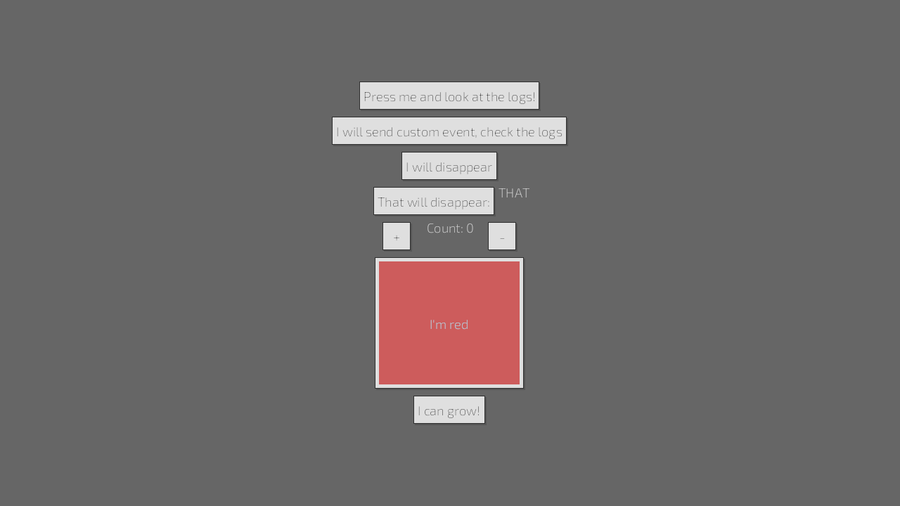
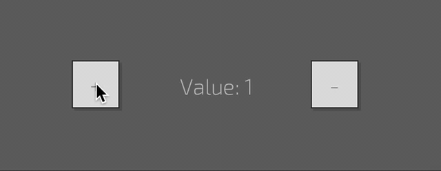
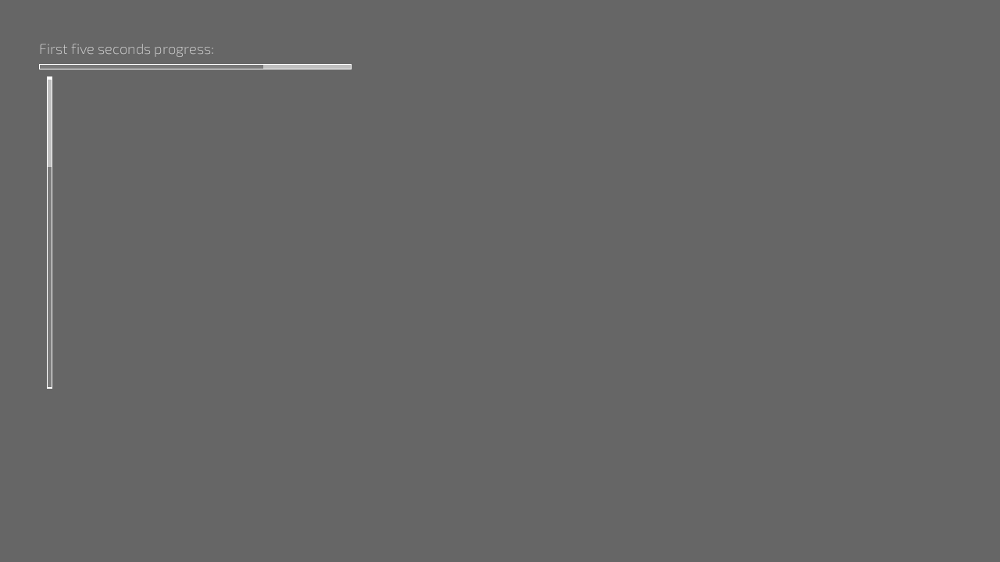
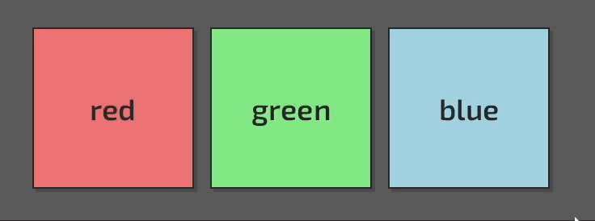
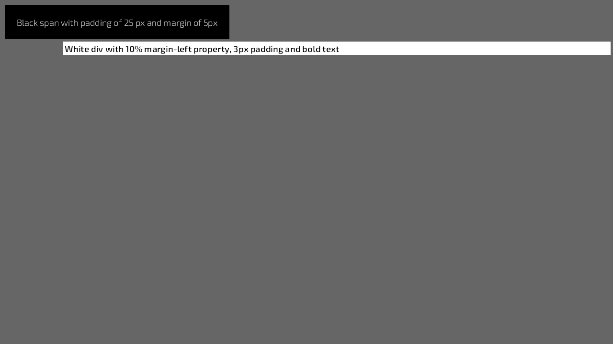

# Examples

## button
Style, handle events and update state with buttons.

## color-picker

## counter-binds

## counter-signals

## elements-modification
Add or remove classes from elements at runtime. 

## for-loop
Create a list of components from a vec.

## hello-world
Simplest of examples.

## image
Display an image in different modes

## image-sources
Display an image with asset handles

## line-breaks
Render text with line breaks

## primary-secondary
Reuse classes to style multiple elements

## progress_bar
Animated progress bar

## scene
Hot reloading using scenes

## selectors
Determine which styles are applied to elements

## slider
Slider widget example 

## sliders
Multiple sliders  

## stylebox-panel

## style-params
Inline styles

## style-sheet
Load an external stylesheet

## tabview
Display UI within tabs

## text-input
Text inputs field

## timer

## ui_scale

## widgets
