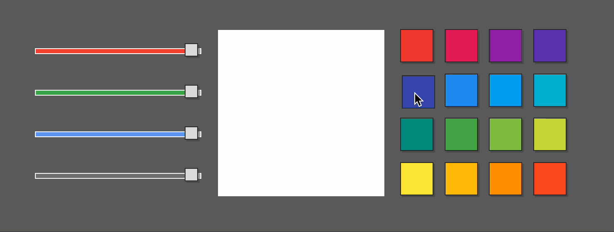
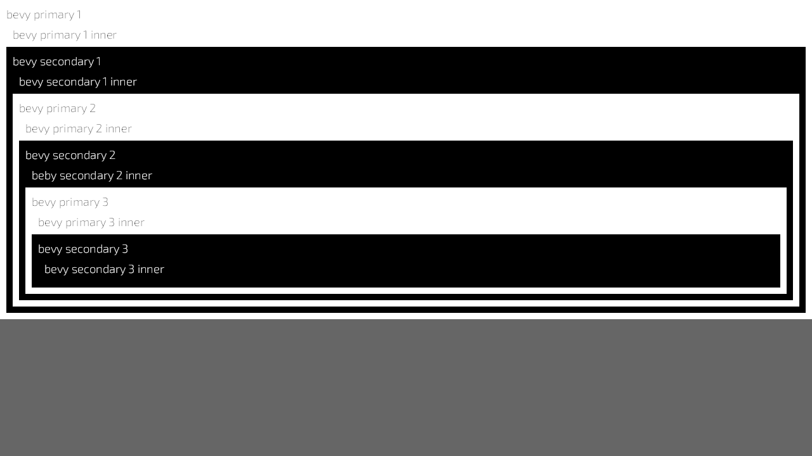
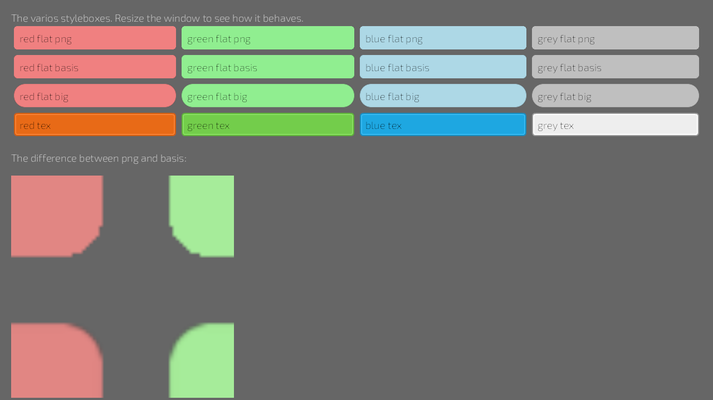
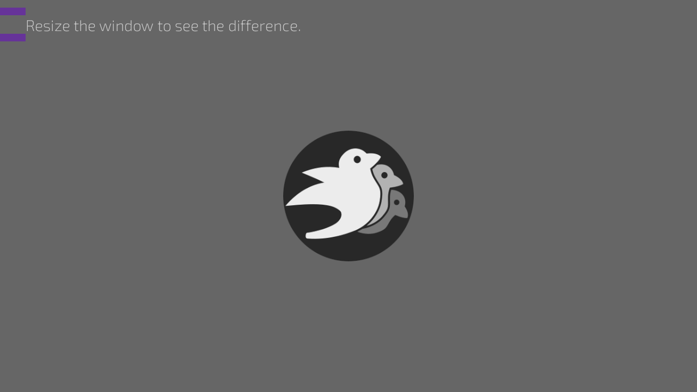

# Interfaces

## [color-picker](color-picker.rs)
Create color-picker by using the bidirectional bindigs

## [image](image.rs)
Display an image in different modes

## [party-editor](party-editor.rs)
Build complex UI by implementing custom widgets for custom logic, organize user input with `<element on:event=run!(..)> ` blocks and bind data with `<element bind:value=to!(..)>`.

# Usecases

## [button](button.rs)
Style, handle events and update state with buttons.

## [connections](connections.rs)
This example demonstrates how you can connect funcs/handlers
to events without writing handler systems. The key feature
this example is connections to any events, so there is no
any `eml!` used.

## [counter-binds](counter-binds.rs)

## [counter-signals](counter-signals.rs)

## [elements-modification](elements-modification.rs)
Add or remove classes from elements at runtime. 

## [for-loop](for-loop.rs)
Create a list of components from a vec.

## [hello-world](hello-world.rs)
Simplest of examples.

## [image-sources](image-sources.rs)
Display an image with asset handles

## [primary-secondary](primary-secondary.rs)
Reuse classes to style multiple elements

## [progress_bar](progress_bar.rs)
Animated progress bar

## [scene](scene.rs)
Hot reloading using scenes

## [selectors](selectors.rs)
Determine which styles are applied to elements

## [slider](slider.rs)
Slider widget example 

## [sliders](sliders.rs)
Multiple sliders  

## [stylebox-panel](stylebox-panel.rs)

## [style-params](style-params.rs)
Inline styles

## [style-sheet](style-sheet.rs)
Load an external stylesheet

## [tabview](tabview.rs)
Display UI within tabs

## [text-input](text-input.rs)
Text inputs field

## [timer](timer.rs)

## [ui_scale](ui_scale.rs)

